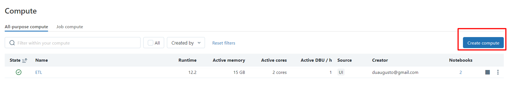
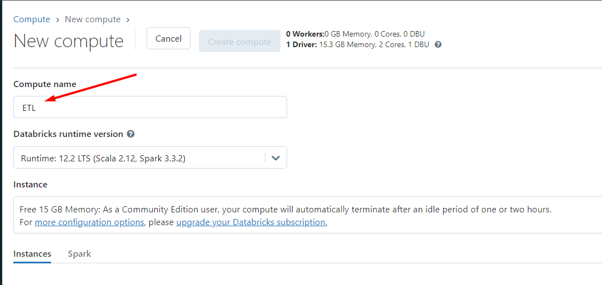
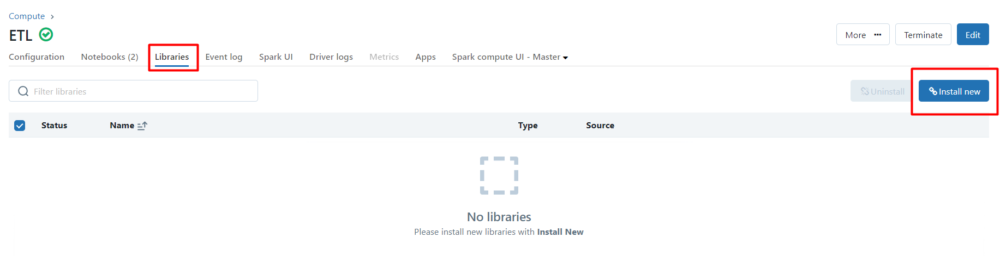
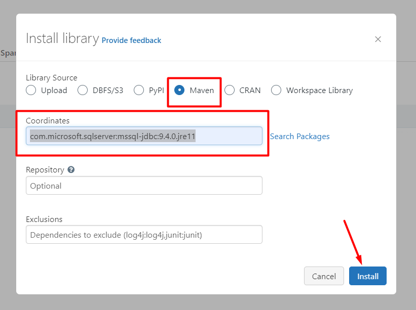

# Conexão Databricks ao SQLServer on Premise.


# Crie um cluster no databricks e vá em libraries e adicione 


<div align="center">
    
</div>

---

<div align="center">
    
</div>

---

## Em alguns casos é necessario criar em Libraries o driver JDBC da microsoft. Coloque o endereço: com.microsoft.sqlserver:mssql-jdbc:9.4.0.jre11

<div align="center">
    
</div>

<div align="center">
    
</div>

```py
#Conexao funcionando, informe usuario, senha, servidor, porta e database.
jdbcUsername = "usuario"
jdbcPassword = "senha"
jdbcHostname = "servidor"
jdbcPort = porta
jdbcDatabase = "database"

jdbcUrl = f"jdbc:sqlserver://{jdbcHostname}:{jdbcPort};databaseName={jdbcDatabase};ssl=false;encrypt=false"
connectionProperties = {
  "user": jdbcUsername,
  "password": jdbcPassword,
  "driver": "com.microsoft.sqlserver.jdbc.SQLServerDriver"
}

#usando um select simples para testar a conexão, deve retornar dados no dataframe.
pushdown_query = "(SELECT * FROM DDD_UF) query_alias"
df = spark.read.jdbc(url=jdbcUrl, table=pushdown_query, properties=connectionProperties)
display(df)

```
---

# Outra forma de conexão que segue o mesmo princípio.

```py
from pyspark.sql import SparkSession

spark = SparkSession.builder.appName("Read from SQL Server").getOrCreate()

# Nesse caso lendo diretamente com pypspark em um dataframe.
# Substituta servidor:porta, banco, usuario, senha##, tabela.
df = spark.read.format("jdbc").option("url", "jdbc:sqlserver://servidor:porta;database=banco;ssl=false;encrypt=false") \
          .option("user", "usuario").option("password", "senha##").option("dbtable", "tabela").load()

df.persist

display(df)

```