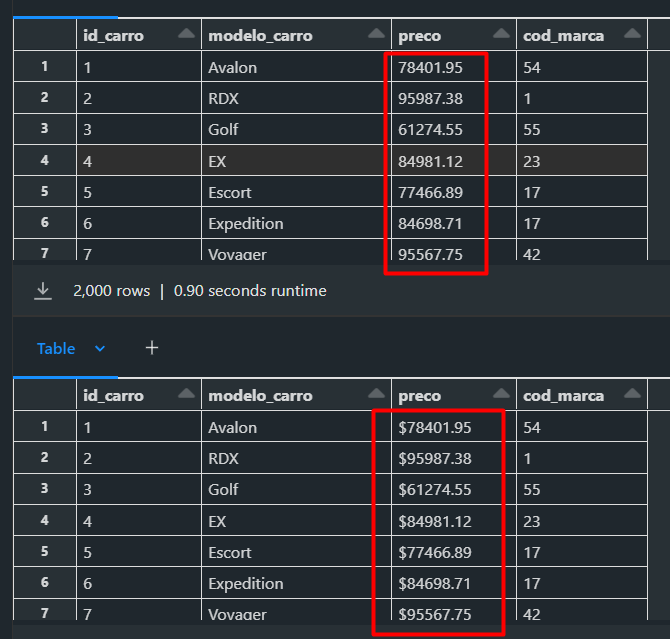
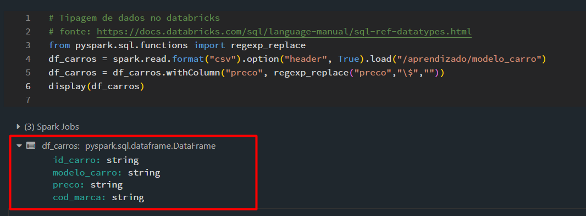
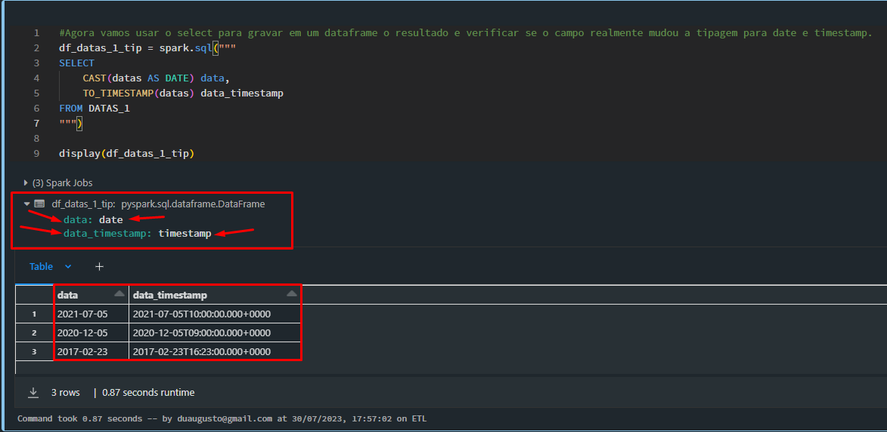
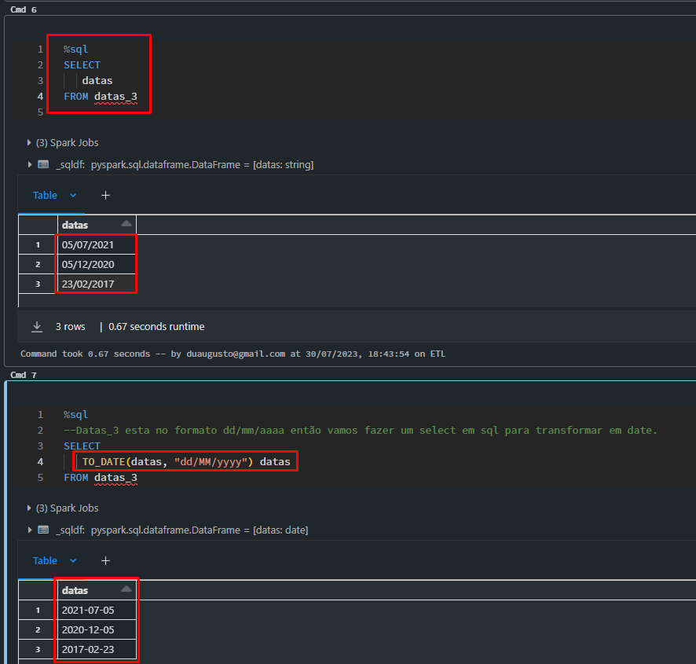

# Projeto Estudo Databricks com Pyspark.
## Pesquisar sobre o case sensitive por exemplo nas palavras usando LIKE.


> Após a criação de um notebook no databricks, importamos 3 arquivos de exemplo para o repositório padrão do databricks (VER mais sobre DBFS)
```py
df1 = spark.read.format("csv").option("header", "true").load("dbfs:/FileStore/shared_uploads/duaugusto@gmail.com/modelo_carro.csv")
df2 = spark.read.format("csv").option("header", "true").load("dbfs:/FileStore/shared_uploads/duaugusto@gmail.com/marcas_duplicadas.csv")
df3 = spark.read.format("csv").option("header", "true").load("dbfs:/FileStore/shared_uploads/duaugusto@gmail.com/marca_carro.csv")

```
---

> Vamos dar um display para verificar os dataframes carregados a partir dos arquivos.

```py
display(df1)
display(df2)
display(df3)

```
---

> Agora vamos escrever esses dataframes em outro local (pasta) usando o write.

```py
df1.write.format("csv").save("/aprendizado/modelo_carro")
df2.write.format("csv").save("/aprendizado/marcas_duplicadas")
df3.write.format("csv").save("/aprendizado/marca_carro")

```
---

> Uma vez criado os dataframes no local indicado podemos usar o comando append ou overwrite, onde o primeiro vai inserir mais dados ao dataframe e o segundo substituirá o conteúdo do dataframe.

```py
# Insere novos registro ou duplica os mesmos.
df1.write.format("csv").mode("append").save("/aprendizado/modelo_carro")

# Substitui o conteúdo.
df2.write.format("csv").mode("overwrite").save("/aprendizado/marcas_duplicadas")
df3.write.format("csv").mode("overwrite").save("/aprendizado/marca_carro")

```
---

> DELETANDO PASTAS NO DATABRICKS ****TOMAR CUIDADO.

```PY
# Funciona
dbutils.fs.rm("/aprendizado/modelo_carro", True)

# Funciona também.
%fs rm -r /aprendizado/modelo_carro

```
---

> Agora vamos contar as linhas dos dataframes.

```py
# Nesse caso estamos lendo o primeiro df que foi gravado no diretorio padrão DBFS, não confundir.
print(df1.count())

# nesse caso estamos lendo o diretorio aprendizado que criamos, ou seja, locais diferentes.
# a opção .option("header", True) possibilita colocar a primeira linha como cabeçalho.
df_carros = spark.read.format("csv").option("header", True).load("/aprendizado/modelo_carro")
print(df_carros.count())

# Visualizando os outros dfs gravados no DBFS.
print(df2.count())
print(df3.count())

```
---

```py
# Passando a option "header" para que possamos ler o cabeçalho que esta na primeira linha do arquivo.
df_carros = spark.read.format("csv").option("header", True).load("/aprendizado/modelo_carro")

# Podemos ainda colocar a option delimiter para dizer qual é o delimitador usado no csv
df_carros = spark.read.format("csv").option("header", True).option("delimiter", ",").load("/aprendizado/modelo_carro")


# Para concatenar melhor o codigo se usa a \
# Podemos ainda colocar a option delimiter para dizer qual é o delimitador usado no csv
df_carros = spark.read.format("csv").option("header", True).option("delimiter", ",").load("/aprendizado/modelo_carro")
display(df_carros)

# Outra forma de passar o delimitador é:
df_carros = spark.read \
            .format("csv") \
            .option("header", True) \
            .load("/aprendizado/modelo_carro", sep = ",")  #outra forma com sep
display(df_carros)

# Nesse codigo usamos a option enconding utf-8 para caracteres e acentuações ja concatenado.
df_carros = spark.read \
            .format("csv") \
            .option("header", True) \
            .option("delimiter", ",") \
            .option("encoding", "utf-8") \
            .load("/aprendizado/modelo_carro") 

```
---

> Podemos escrever os dados que estão em csv para outros formatos como parquet, json ou avro.

```py
# Escrevendo os arquivos em formato parquet, json e avro
# Nao esquecendo que também podemos usar o option append ou overwrite
df_carros.write.format("parquet").save("/aprendizado/modelo_carro_parquet")
df_carros.write.format("json").save("/aprendizado/modelo_carro_json")
df_carros.write.format("avro").save("/aprendizado/modelo_carro_avro")

```
---
> Agora vamos ler o arquivo json como exemplo

```py
# Sempre vamos precisar de outro dataframe para fazer a leitura.

df_carros_json = spark.read \
                .format("json") \
                .option("header", True) \
                .load("/aprendizado/modelo_carro_json")
display(df_carros_json)

```
---

> SELECT no pyspark. Vamos ler a tabela e as opções.

```py
#Defina o DF (tome cuidado ao definir dataframes pois ele vai substituir algum já usado)

# Select basico 
df_carros = spark.read.format("csv").option("header", True).load("/aprendizado/modelo_carro")
display(
        df_carros.where("id_carro = '1'")     #Sempre com display para mostrar o resultado 
       )

```
---

> VAMOS USAR O Transaction SQL para fazer um exemplo

```py
# Criando uma tabela temporária que irá receber o SELECT do SQL.
df_carros.createOrReplaceTempView("carros")      # note que chamamos a tabela de carros

```
> Agora vamos rodar um script em SQL usando o databricks

```sql

%sql
--Percebi que para cada query precisa colocar o ;
--Então não faz muito sentido pois nao vai rodar tudo, vai rodar uma e mostrar so a ultima.
SELECT *
FROM CARROS 
WHERE id_carro='1';

SELECT DISTINCT * 
FROM CARROS; 

SELECT
     REPLACE(PRECO,'$','') AS PRECO
FROM CARROS;

```
> Se quisermos gravar o resultado em um dataframe para uso posterior podemos fazer o seguinte.

```py

df_carros_sql = spark.sql("""

SELECT
     REPLACE(PRECO,'$','') AS PRECO
FROM CARROS;

""")
display(df_carros_sql)

```
---
> Agora vamos fazer esses selects no pyspark com distinct e dropDuplicates (lembrando que os dois fazem a mesma coisa)

```py
# Vamos definir um datatrame que vai receber o resultado de outro dataframe.

df_carros_pyspark = df_carros.distinct()   # Lembrando que df_carros tem a tabela duplicada.
df_carros_pyspark = df_carros.dropDuplicates()   # Lembrando que df_carros tem a tabela duplicada.

print(df_carros.count())           # verificando quantos registros em em df_carros
print(df_carros_pyspark.count())   # verificando o resultado do dataframe com o distinct.

```
---

> Select simples no pyspark. Lembrando sempre que uma vez setado o df correspondente, outros nao trarão o mesmo resultado.

```py
from pyspark.sql.functions import *

# Tipos de selects no pyspark
df_carros = df_carros.select("modelo_carro", "id_carro")
display(df_carros)

# Tipos de selects no pyspark
df_carros = df_carros.select(col("modelo_carro").alias("modelo"), col("id_carro").alias("ID"))
display(df_carros)


```

```py
from pyspark.sql.functions import *


# Tipos de selects no pyspark
df_carros1 = df_carros.selectExpr("modelo_carro AS modelo", "id_carro")
display(df_carros1)

```

> Usando o replace do pyspark

```py
#Lembrando que a função regex_replace é nativa do sql, sendo assim temos que importar a biblioteca do sql

from pyspark.sql.functions import regexp_replace      #Poderiamos colocar o * que importaria tudo.

df_carros_spark_2 = df_carros     # definindo que o novo dataframe receberá os dados de df_carros

df_carros_spark_2 = df_carros_spark_2 \
                    .withColumn("preco", regexp_replace("preco","\$",""))  #importante o \ para a substituição.

# colocamos esse novo dataframe para nao perder o dataframe df_carros que ainda contem o original dos dados.
display(df_carros_spark_2)

#visualizando o original dos dados em df_carros
display(df_carros)

```
<div align="center">
    
</div>

---

## Tipagem de dados usando databricks, fonte: https://docs.databricks.com/sql/language-manual/sql-ref-datatypes.html

```py

# Tipagem de dados no databricks
# fonte: https://docs.databricks.com/sql/language-manual/sql-ref-datatypes.html

from pyspark.sql.functions import regexp_replace 

df_carros = spark.read.format("csv").option("header", True).load("/aprendizado/modelo_carro")

df_carros = df_carros.withColumn("preco", regexp_replace("preco","\$",""))
display(df_carros)

```

<div align="center">
    
</div>

---
> Vamos fazer um código sql para alterar a tipagem dos dados.

```py
#criando uma tabela temporaria para receber o codigo sql

df_carros.createOrReplaceTemView("carros")

```

```sql
%sql       
--Select para tipar os dados e gravar no dataframe posteriormente
SELECT
     CAST(id_carro as int) id_carro,
     modelo_carro,
     CAST(preco as double) preco,
     CAST(cod_marca as int) cod_marca
FROM CARROS

```

---
> Com o select pronto agora vamos atribuir ao dataframe o resultado, desta forma ele irá receber a informação.

```py

# Dataframe recebe o select ja tipando os dados da consulta.
df_carros = spark.sql("""

SELECT
     CAST(id_carro as int) id_carro,
     modelo_carro,
     CAST(preco as double) preco,
     CAST(cod_marca as int) cod_marca
FROM CARROS
""")

#Verificando o resultado e também a tipagem que esta no dataframe.
display(df_carros)

df_carros.printSchema()

```

---
> Vamos tipar usando apenas pyspark agora.

```py
# nao podemos esquecer de importar a biblioteca do sql para esse tipo de alteração.
from pyspark.sql.functions import *

#Tipagem da coluna id_carro para int.
df_carros = df_carros.withColumn("id_carro", col("id_carro").cast("int")) \
                     .withColumn("preco",    col("preco")   .cast("double"))

display(df_carros)

```
> Outra forma seria usando o select ****(Aparentemente é mais simples)** e o que pude perceber é que ele traz apenas o resultado das colunas selecionadas.

```py
# nao podemos esquecer de importar a biblioteca do sql para esse tipo de alteração.
from pyspark.sql.functions import *

#Tipagem da coluna id_carro para int.
# O grande problema aqui é que isso ficará setado no df e as outras colunas se perderão.
# Então como tratar isso corretamente, o withColumn é melhor?
df_carros = df_carros.Select(
                      col("id_carro").cast("int")),
                      col("preco")   .cast("double"))

display(df_carros)

```
---

> NESSE EXEMPLO, VAMOS REFAZER para entender o processo do uso do select para tipagem.

```py

# nao podemos esquecer de importar a biblioteca do sql para esse tipo de alteração.
from pyspark.sql.functions import *

# Como ja setamos o df sem as colunas no exemplo anterior, vamos ter que ler novamente a fonte de dados.
df_carros = spark.read.format("csv")\
            .option("header", True)\
            .load("/aprendizado/modelo_carro")

#Nesse caso estamos novamente fazendo replace do caractere $ da coluna preço.
df_carros = df_carros.withColumn("preco", regexp_replace("preco", "\$",""))


# Agora vamos também colocar as colunas modelo_carro e id_carro que não vão receber tipagem.
# Então como tratar isso corretamente, o withColumn é melhor?
df_carros = df_carros.select(
                      col("id_carro").cast("int"),
                      col("modelo_carro"),
                      col("preco").cast("double"),
                      col("cod_marca")    
)
display(df_carros)
df_carros.printSchema()

```
---
> Mais uma forma de TIPAR os dados é usar as FUNÇÕES.

```py
# Vamos importar a biblioteca que trata da função dos tipos de dados.
from pyspark.sql.types import *

#trocamos a informação "int" ou "double" pela função correta.
df_carros = df_carros.select(
                      col("id_carro").cast(IntegerType()),
                      col("modelo_carro"),
                      col("preco").cast(DoubleType()),
                      col("cod_marca")    
)
display(df_carros)
df_carros.printSchema()

```
---

> Like e Between no pyspark.

```py 
from pyspark.sql.functions import *
from pyspark.sql.types import *

# Vamos ler os dados.
df_carros = spark.read. format("csv").option("header", True).load("/aprendizado/modelo_carro")

# Remove caractere especial
df_carros = df_carros.withColumn("preco", regexp_replace(col("preco"),"\$",""))

# Tipar os dados
df_carros = df_carros.select(
                              col("id_carro").cast(IntegerType()),
                              "modelo_carro",
                              col("preco").cast(DoubleType()),   #podemos usar DecimalTyes(18,2) por exemplo
                              col("cod_marca").cast(IntegerType())
                            )
display(df_carros)
df_carros.printSchema()

```

```py
# Vamos criar uma tabela temporaria em sql para exemplo
df_carros.createOrReplaceTempView("carro")
df_carros_like = spark.sql("""

SELECT *
FROM carro
WHERE modelo_carro Like "%alo%"

""")

display(df_carros_like)

```

```sql

%sql
-- Para escrever em linguagem sql.
SELECT *
FROM carro
WHERE modelo_carro Like "%alo%"


%sql
-- exemplo do between
SELECT *
FROM carro
WHERE preco Between 60000 and 75000

```

---

> Agora vamos escrever o like e o between em pyspark.

```py
# Like no pyspark

df_carros_spark = df_carros
# Detalhe importante que a a cada dataframe novo deve se chamar o mesmo e depois do = selecionar o que se quer.
df_carros_spark = df_carros_spark.where(
 col("modelo_carro").like("%alo%")
)
display(df_carros_spark)

```

```py
# Between
df_carros_spark = df_carros
df_carros_spark = df_carros_spark.where(
 col("preco").between(50000, 75000)
)
display(df_carros_spark)

```
---

> Substring Left e Right.

```py
# Exemplo gravando em um dataframe df_carros_sql o resultado da query em sql.
df_carros_sql = df_carros
df_carros_sql = spark.sql("""
SELECT
      modelo_carro,
      SUBSTRING(MODELO_CARRO,2,3) as substring,
      LEFT(modelo_carro,2) left,
      RIGHT(modelo_carro,2) right
FROM carro
""")
display(df_carros_sql)

```

```py
#Escrevendo em pyspark.
#Concatenação importante. Verificar cada função pois muda muito do SQL.
df_carros_pyspark = df_carros
df_carros_pyspark = df_carros_pyspark.withColumn(
    "modelo_sub", substring("modelo_carro", 3, 1)
).withColumn(
    "modelo_RIGHT", expr("RIGHT (modelo_carro, 2)")  #usa expr 
).withColumn(
    "modelo_LEFT", expr("LEFT (modelo_carro,2)")     #usa expr
)

display(df_carros_pyspark)

```
---

## Trabalhando com tipagem de datas no pyspark.

```py 
# Exemplos de formatos de data lembrando que todas estão como string.
df_datas_1 = spark.createDataFrame(["2021-07-05T10:00:00.000+0000","2020-12-05T09:00:00.000+0000","2017-02-23T16:23:00.000+0000"], "string").toDF("datas")
df_datas_2 = spark.createDataFrame(["2021-07-05 10:00","2020-12-05 09:00","2017-02-23 16:00"], "string").toDF("datas")
df_datas_3 = spark.createDataFrame(["2021-07-05","2020-12-05","2017-02-23"], "string").toDF("datas")

display(df_datas_1)
display(df_datas_2)
display(df_datas_3)

```


> Vamos escrever primeiro em sql so como exemplo para fixar bem.

```py
#Primeiro temos que criar as tabelas temporárias que receberão o codigo sql.
df_datas_1.createOrReplaceTempView("datas_1")
df_datas_2.createOrReplaceTempView("datas_2")
df_datas_3.createOrReplaceTempView("datas_3")

```

```sql
%sql
--Percebi que temos que fazer um bloco de cada vez para o sql, ele nao aceita 2 selects.
SELECT
    CAST(datas AS DATE) data,
    TO_TIMESTAMP(datas) data_timestamp
FROM DATAS_1

```

```sql
%sql
--Exemplo com timestamp
SELECT
    TO_TIMESTAMP(datas AS DATE) data
FROM DATAS_1

```

```sql
%sql
SELECT
--Aqui estamos fazendo os 2 exemplos de uma vez só.
    CAST(datas AS DATE) data,
    TO_TIMESTAMP(datas) data_timestamp
FROM DATAS_1
```

```py
#Agora vamos usar o select para gravar em um dataframe o resultado e verificar 
#se o campo realmente mudou a tipagem para date e timestamp.
df_datas_1_tip = spark.sql("""
SELECT
    CAST(datas AS DATE) data,
    TO_TIMESTAMP(datas) data_timestamp
FROM DATAS_1                           
""")

display(df_datas_1_tip)

```
<div align="center">
    
</div>

```sql
%sql
--Select em datas_3 tendo como resultado dd/MM/yyyy
SELECT
   datas 
FROM datas_3

```
```sql
%sql
--Datas_3 esta no formato dd/MM/yyyy então vamos fazer um select em sql para transformar em date.
SELECT
   TO_DATE(datas, "dd/MM/yyyy") datas
FROM datas_3

```

<div align="center">
    
</div>

```py
#Sempre importar as bibliotecas necessárias para os comandos.
from pyspark.sql.functions import *

#Agora vamos fazer em pyspark a tipagem dessas datas.
df_datas_1_spark = df_datas_1
df_datas_1_spark = df_datas_1_spark.withColumn("datas", to_timestamp("datas"))

display(df_datas_1_spark)

#Tipando df_datas_2 lembrando que ja segue um padrao e tem apenas as horas junto, (yyyy-MM-dd HH:mm)
df_datas_2_spark = df_datas_2
df_datas_2_spark = df_datas_2_spark.withColumn("datas", to_date("datas"))

display(df_datas_2_spark)

#Tipando df_datas_3 lembrando que ja segue um padrao diferente, (dd/MM/yyyy)                                               
df_datas_3_spark = df_datas_3
df_datas_3_spark = df_datas_3_spark.withColumn("datas", to_date("datas", "dd/MM/yyy"))  # se tivesse a hora e minuto poderiamos deixar como to_date ou to_timestamp adicionando "dd/mm/yyyy HH:mm"

display(df_datas_3_spark)

```
## Databricks: INNER JOIN, RIGHT e LEFT JOIN usando PySpark e SQL

```py
from pyspark.sql.functions import *

# Lendo os 2 arquivos e lembrando que as origens nao estão duplicadas, mas conforme o curso foi acontecendo modelo_carro tem 2.000 registros. (duplicados)
df_carros = spark.read.format("csv").option("header","true").load("/aprendizado/modelo_carro")
df_marcas = spark.read.format("csv").option("header","true").load("/aprendizado/marca_carro")

display(df_carros)
display(df_marcas)

```
> Contagem das linhas e filtrando dados com distinct.

```py
#Contagem primeiro do total de registros do df
print(df_carros.count())

#Filtrando os registros e removendo o codigo 22 com distinct
df_carros = df_carros.where(col("cod_marca") !='22').distinct()
print(df_carros.count())

# a retirada do codigo 22 irá ajudar no right e left join para exemplo pois as tabelas eram iguais.

```
> Exemplo do INNER JOIN em sql.
```sql
%sql
SELECT a.*,b.*
FROM carros A
INNER JOIN marcas b on a.cod_marca=b.cod_marca

```
> Exemplo de INNER JOIN no pyspark

```py
# Criamos outro dataframe que vai receber o join
df_innerjoin_spark = df_carros.join(
df_marcas,
(df_carros.cod_marca == df_marcas.cod_marca), "inner"
)

display(df_innerjoin_spark)

```

```py
# Right join lembrando que nao usamos a opção where a.cod_marca is null **pesquisar.
df_right_spark = df_carros.join(
df_marcas,
(df_carros.cod_marca == df_marcas.cod_marca), "right"
)

display(df_right_spark)

```
```py
# Left join lembrando que nao usamos a opção where b.cod_marca is null **pesquisar.
# Usamos o left e fique atento pois foi invertido os dfs entre df_carros e df_marcas
# Nesse caso o codigo 22 ira aparecer mas em df_carros ficará como nulo pois nao tem filtro.
df_right_spark = df_marcas.join(
df_carros,
(df_carros.cod_marca == df_marcas.cod_marca), "left"
)

display(df_right_spark)

```

```py
df_leftjoin_spark = df_marcas.join(
df_carros,
(df_carros.cod_marca == df_marcas.cod_marca), "left"
).where(df_carros.cod_marca.isNotNull())    #Filtro aplicado nao trazer nulos, codigo 22 nao aparece.

display(df_leftjoin_spark)

```


```py
# Vamos usar um select junto ao join para selecionar campos específicos.
# Usamos o left e fique atento pois foi invertido os dfs entre df_carros e df_marcas
df_right_spark = df_marcas.join(
df_carros,
(df_carros.cod_marca == df_marcas.cod_marca), "left"
).select(
          df_marcas.marca_carro,
          df_carros["*"]
)

display(df_right_spark)

```
## Funções EXISTS e LEFT SEMI JOIN no SQL e Pyspark.

```py
from pyspark.sql.functions import *

# Leitura do arquivo lembrando que estamos usando distinct pois ha duplicações no mesmo por outros estudos.
df_carros = spark.read.format("csv").option("header",True).load("/aprendizado/modelo_carro").distinct()

display(df_carros)

# Selecionando apenas 3 id_carros para o exemplo
df_carros_source = df_carros.where(
    (col("id_carro") == '1') |
    (col("id_carro") == '2') | 
    (col("id_carro") == '3') 
)

# Selecionando 4 id_carros para o exemplo.
df_carros_final = df_carros.where(
    (col("id_carro") == '1') |
    (col("id_carro") == '2') | 
    (col("id_carro") == '3') |
    (col("id_carro") == '4')
)

display(df_carros_source)
display(df_carros_final)

```
---
> Criação de duas tabelas temporarias para fazer o teste em SQL.
```py
df_carros_source.createOrReplaceTempView("carros_source")
df_carros_final.createOrReplaceTempView("carros_final")

```


