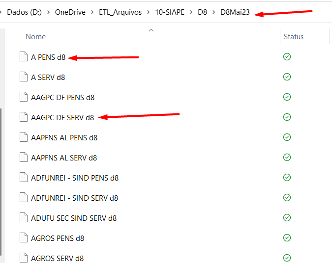

# Rotina Mensal SIAPE tabela Contrato

### Os arquivos vem dessa forma como a figura demonstra. Os mesmos devem juntar com a mesma estrutura a principio copiando via CMD os tipos SERV e PENS. Abaixo vamos descrever esse processo.

    

